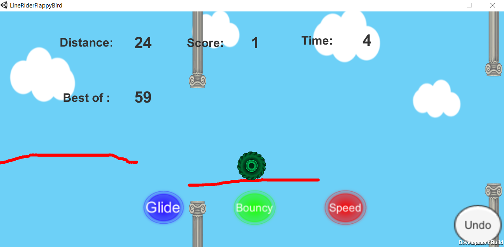

# LineRiderFlappyBird
A mashup of Line Rider and Flappy Bird, the game is phone ready! Developed in Unity engine C#.

# HOW to
Run the .exe file, or open project in unity to build or run program.
This is an endless game where the player is supposed to make the wheel move through
passages by drawing collider lines with several different effects.

See screenshot below:

